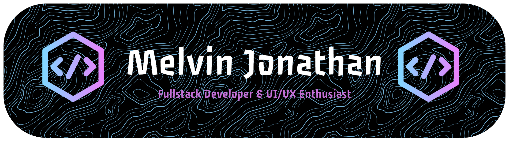

<h5 align="left">Undergraduate Computer Science Major on BINUS University Alam Sutera</h5>

###

<h3 align="left">📲 Socials:</h3>

###

  

  

  

  

  

###

<h2 align="left">💻 Tech Stack:</h2>

###

  
  
  
  
  
  
  
  
  
  
  
  
  
  
  
  
  
  
  
  
  
  
  
  
  
  
  
  
  
  
  
  
  
  
  
  
  
  
  
  
  
  
  
  
  
  
  

###

<h2 align="left">📊 Github Stats:</h2>

###

  
  

###

###
